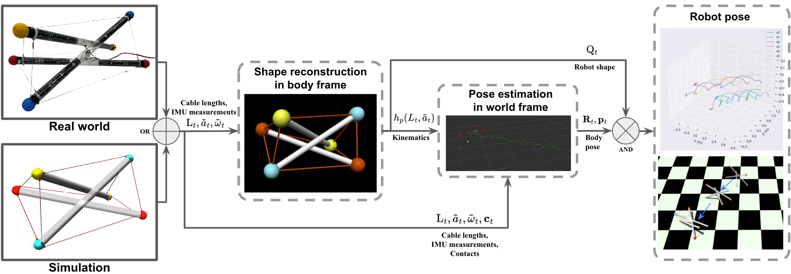

<p align="center">
<!--    -->
  
  <h3 align="center"><strong>Tensegrity Robot Proprioceptive State Estimation with Geometric Constraints</strong></h3>

  <p align="center">
      <a href="https://jonathan-twz.github.io/" target='_blank'>Wenzhe Tong</a><sup>1</sup>&nbsp;&nbsp;&nbsp;
      <a href="https://tzuyuan.github.io/" target='_blank'>Tzu-Yuan Lin</a><sup>1</sup>&nbsp;&nbsp;&nbsp;
      <a href="https://www.linkedin.com/in/jonathanmi6/" target='_blank'>Jonathan Mi</a><sup>1</sup>&nbsp;&nbsp;&nbsp;
      <a href="https://www.linkedin.com/in/yicheng-jiang-635842213/?locale=en_US" target='_blank'>Yicheng Jiang</a><sup>1</sup>&nbsp;&nbsp;&nbsp;
      <a href="https://name.engin.umich.edu/people/ghaffari-maani/" target='_blank'>Maani Ghaffari</a><sup>1</sup>&nbsp;&nbsp;&nbsp;
      <a href="https://robotics.umich.edu/profile/xiaonan-sean-huang/" target='_blank'>Xiaonan Huang</a><sup>1</sup>
  <br />
  <sup>1</sup>University of Michigan, Ann Arbor&nbsp;&nbsp;&nbsp;
  </p>
</p>

<p align="center">
  <a href="https://arxiv.org/abs/2410.24226" target='_blank'>
    
  </a>

  <!-- TODO: update project page -->
  <a href="https://github.com/Jonathan-Twz/tensegrity-robot-state-estimator" target='_blank'>
    
  </a>

  <!-- TODO: update demo link -->
  <a href="https://github.com/Jonathan-Twz/tensegrity-robot-state-estimator" target='_blank'>
    
  </a>
  
  <!-- <a href="" target='_blank'>
    
  </a> -->
  
  <!-- TODO: update visitor badge -->
  <!-- <a href="" target='_blank'>
    
  </a> -->
</p>

## About  

`tensegrity robot state estimator` is a novel framework designed to estimate the 3-bar tensegrity robot shape and pose. 
- To the best of our knowledge, this work is the first proprioceptive Invariant Extended Kalman Filter (InEKF) state estimator that can estimate both shape and pose of the 3-bar tensegrity robot.
- We introduced a measurement model tailored to the kinematics of tensegrity robots.
- We  incorporated geometric properties of the 3-bar tensegrity robot as constratins in the robot shape reconstruction process using constrained optimization.

## Framework
|  |
| :-: | 
| Both real-world or simulated IMU and cable length sensors are inputs into an optimization-based robot shape reconstruction algorithm. The reconstructed shape provides the positions of the robot’s endcaps in the body frame. Next, the computed kinematics, based on the contact points between the endcaps and ground, are utilized within a contact-aided Invariant EKF to estimate the robot pose. Finally, the global endcap positions are computed by transforming the reconstructed shape into the body pose within a global frame. |


## Updates

- \[2024.10\] - Our [paper](https://arxiv.org/abs/2410.24226) is available on arXiv.


## Outline

- [About](#about)
- [Framework](#framework)
- [Updates](#updates)
- [Outline](#outline)
- [TODO List](#todo-list)
- [Citation](#citation)
- [License](#license)


<!-- ## :gear: Installation

For details related to installation and environment setups, kindly refer to [INSTALL.md](assets/INSTALL.md).


## :rocket: Getting Started

To learn more usage about this codebase, kindly refer to [GET_STARTED.md](assets/GET_STARTED.md). -->

## TODO List
- [x] Initial README
- [x] ArXiv paper release
- [ ] Initial code release

## Citation
If you find this work helpful for your research, please kindly consider citing our papers:

```bibtex
 @article{tong2024tensegrity,
            title={Tensegrity Robot Proprioceptive State Estimation with Geometric Constraints},
            author={Tong, Wenzhe and Lin, Tzu-Yuan and Mi, Jonathan and Jiang, Yicheng and Maani Ghaffari and Huang, Xiaonan},
            journal={arXiv preprint arXiv:2410.24226},
            year={2024}
          }
```


## License

This work is under the <a rel="license" href="">MIT License</a>, while some specific implementations in this codebase might be with other licenses. Kindly refer to [LICENSE](assets/LICENSE) for a more careful check, if you are using our code for commercial matters.


<!-- ## Acknowledgements

This work is developed based on the [MMDetection3D](https://github.com/open-mmlab/mmdetection3d) codebase.

> <br>
> MMDetection3D is an open-source toolbox based on PyTorch, towards the next-generation platform for general 3D perception. It is a part of the OpenMMLab project developed by MMLab. -->
